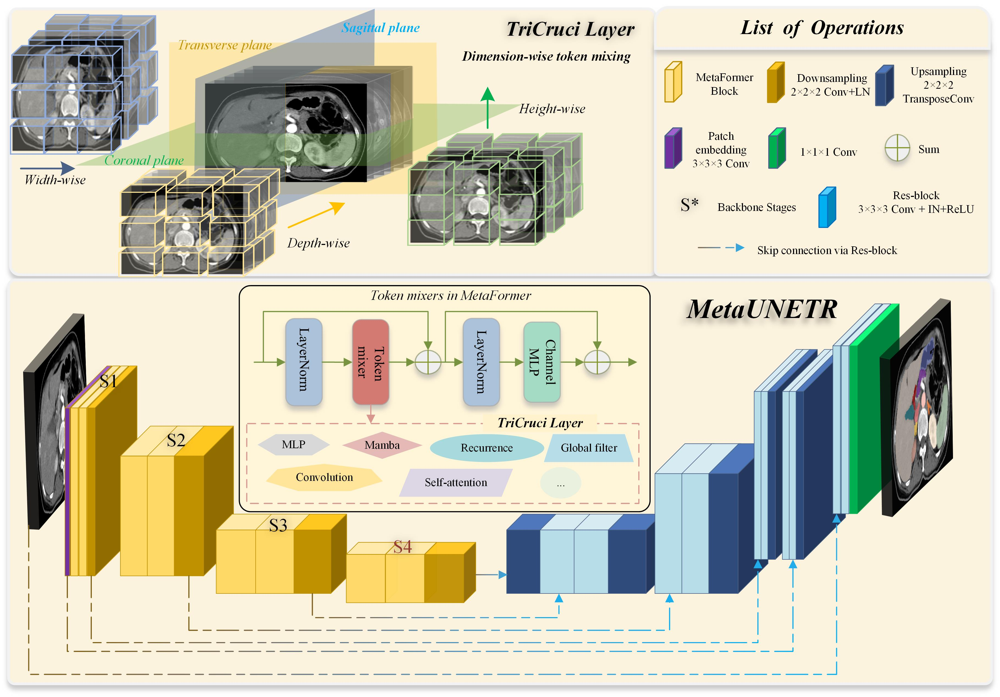
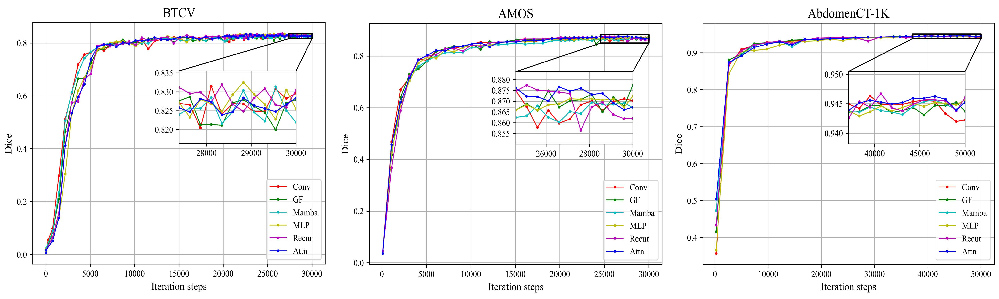
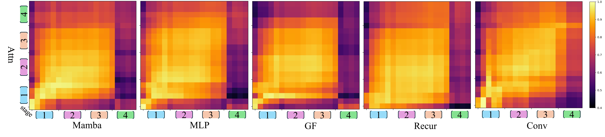

# MetaUNETR: Rethinking Token Mixer Encodingfor Efficient Multi-Organ Segmentation
This repository is the official model implementation of our accepted paper in MICCAI 2024.

**Authors:** Pengju Lyu, Jie Zhang, Lei Zhang, Wenjian Liu, Cheng Wang, Jianjun Zhu

## Abstract
The Transformer architecture and versatile CNN backbones
have led to advanced progress in sequence modeling and dense prediction tasks. A critical development is the incorporation of different to-
ken mixing modules such as ConvNeXt, Swin Transformer. However,
findings within the MetaFormer framework suggest these token mixers
have a lesser influence on representation learning than the architecture
itself. Yet, their impact on 3D medical images remains unclear, motivating our investigation into different token mixers (self-attention, convo-
lution, MLP, recurrence, global filter, and Mamba) in 3D medical image segmentation architectures, and further prompting a reevaluation
of the backbone architecture’s role to achieve the trade off in accuracy
and efficiency. In the paper, we propose a unified segmentation architecture—MetaUNETR featuring a novel TriCruci layer that decomposes the
token mixing processes along each spatial direction while simultaneously
preserving precise positional information on its orthogonal plane. By employing the Centered Kernel Alignment (CKA) analysis on feature learn
ing capabilities among these token mixers, we find that the overall archi-
tecture of the model, rather than any specific token mixers, plays a more
crucial role in determining the model’s performance. Our method is vali
dated across multiple benchmarks varying in size and scale, including the
**BTCV, AMOS, and AbdomenCT-1K** datasets, achieving the top segmen
tation performance while reducing the model’s parameters by about 80%
compared to the state-of-the-art method. This study provides insights for
future research on the design and optimization of backbone architecture,
steering towards more efficient foundational  foundational segmentation models.

## Description

Our findings reveal that the general architecture of MetaFormers is more vital for model performance than any specific token mixer module. Comparative analyses using CKA uncovered significant similarities and the importance of features within the upper encoder layers while also identifying redundant computation in the bottom layers.

## Prerequisites
- Ubuntu 20.04.5 LTS
- Python 3.8
- torch 2.0.1
- torchvision 0.15.2
- CUDA 11.8
- monai 1.2.0
